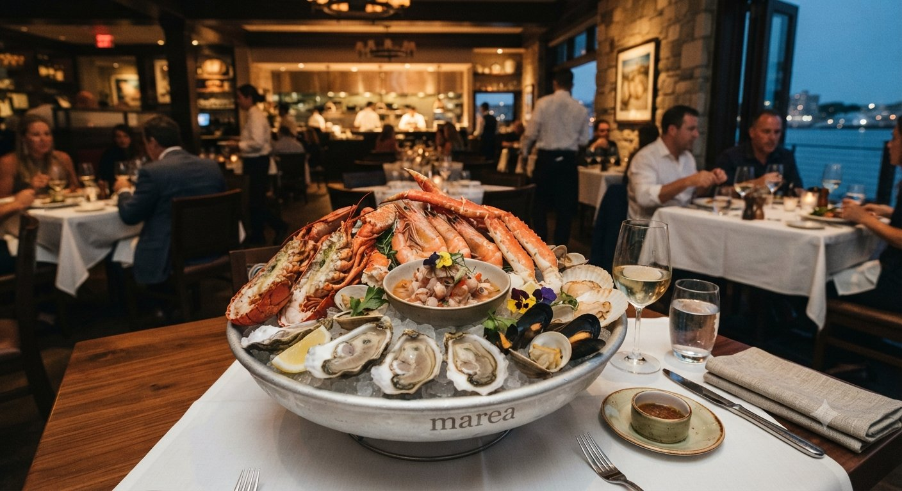

# Marea — Sitio web del restaurante

Sitio estático de dos páginas (`index.html` y `menu.html`), sin dependencias
de build: se puede abrir directamente en el navegador o subir tal cual a
cualquier hosting.

## Estructura

```
index.html            Página principal
menu.html              Página de menú
assets/css/style.css   Estilos (paleta, tipografía, layout responsive)
assets/js/main.js      Navegación móvil y encabezado al hacer scroll
assets/images/         Carpeta destino de todas las fotografías e íconos
```

## Insertar tus fotografías

Cada `` en `index.html` y `menu.html` tiene, justo encima, un comentario
HTML con la ruta esperada y el tamaño/orientación recomendados, por ejemplo:

```html
<!-- INSERTAR AQUÍ: imagen principal (hero)... Recomendado 1920x1200px, horizontal... -->

```

Basta con guardar tu archivo final dentro de `assets/images/` con el mismo
nombre indicado en el `src` (o actualizar la ruta si usas otro nombre). No es
necesario tocar el HTML ni el CSS: el diseño, el recorte (`object-fit`) y el
espaciado ya están resueltos para cada imagen.

Imágenes a reemplazar:

- `favicon.png`
- `hero-principal.jpg`, `hero-menu.jpg`
- `nosotros.jpg`
- `plato-01.jpg`, `plato-02.jpg`, `plato-03.jpg`
- `sala-01.jpg`, `sala-02.jpg`, `sala-03.jpg`
- `reservas.jpg`

## Paleta y tipografía

- Azul marino (`#0f2233`), marfil (`#f6f1e7`) y latón envejecido (`#a9803f`).
- Tipografía: Libre Baskerville (revival libre de la fuente inglesa de John
  Baskerville), cargada desde Google Fonts.

## Datos a personalizar

Dirección, teléfono, correo y enlaces a redes sociales son texto de ejemplo:
están marcados con comentarios `<!-- Sustituir por ... -->` en ambos archivos
HTML.
