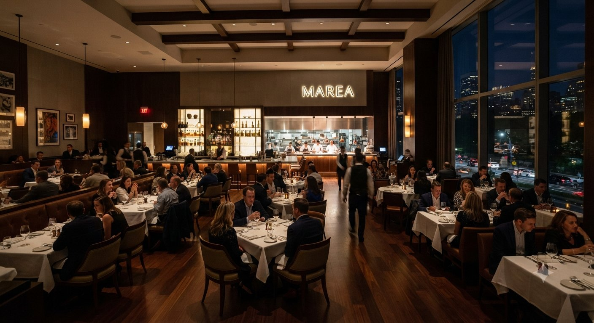

# Marea — Sitio web del restaurante

Sitio estático de dos páginas (`index.html` y `menu.html`), sin dependencias
de build: se puede abrir directamente en el navegador o subir tal cual a
cualquier hosting.

## Estructura

```
index.html            Página principal
menu.html              Página de menú
assets/css/style.css   Estilos (paleta, tipografía, layout responsive)
assets/js/main.js      Navegación móvil, encabezado al hacer scroll, idioma/moneda y reservas por WhatsApp
assets/images/         Carpeta destino de todas las fotografías e íconos
```

## Insertar tus fotografías

Cada `` en `index.html` y `menu.html` tiene, justo encima, un comentario
HTML con la ruta esperada y el tamaño/orientación recomendados, por ejemplo:

```html
<!-- INSERTAR AQUÍ: imagen para la sala... Recomendado 1920x1200px, horizontal... -->

```

Basta con guardar tu archivo final dentro de `assets/images/` con el mismo
nombre indicado en el `src` (o actualizar la ruta si usas otro nombre). No es
necesario tocar el HTML ni el CSS: el diseño, el recorte (`object-fit`) y el
espaciado ya están resueltos para cada imagen.

Ya insertadas (fotografías reales proporcionadas): `hero-principal.jpg`,
`hero-menu.jpg`, `nosotros.jpg`, `plato-01.jpg`, `plato-02.jpg`, `plato-03.jpg`.

Pendientes de reemplazar por fotografía real:

- `favicon.png`
- `sala-01.jpg`, `sala-02.jpg`, `sala-03.jpg`
- `reservas.jpg`

## Paleta y tipografía

- Azul marino (`#0f2233`), marfil (`#f6f1e7`) y latón envejecido (`#a9803f`).
- Tipografía: Libre Baskerville (revival libre de la fuente inglesa de John
  Baskerville), cargada desde Google Fonts.

## Idioma y moneda

El encabezado incluye un selector ES/EN (`assets/js/main.js`). Cambiar el
idioma traduce todo el texto marcado con `data-i18n` y recalcula los precios
marcados con `data-price` (el valor del atributo está siempre en pesos
mexicanos, MXN):

- Español → precios en MXN.
- English → precios convertidos a USD con un tipo de cambio fijo de 16 MXN
  por dólar (editable en la constante `USD_RATE` de `assets/js/main.js`).

La preferencia de idioma se guarda en `localStorage` y se mantiene al navegar
entre `index.html` y `menu.html`.

## Reservas por WhatsApp

Todos los botones de reserva (`data-whatsapp-cta`) abren un chat de WhatsApp
al número `+52 656 859 6503` con un mensaje precargado en el idioma activo.
El número y los mensajes se configuran en `WHATSAPP_NUMBER` y
`whatsapp_message` dentro de `assets/js/main.js`.

## Redes sociales y contacto

Instagram y Facebook (pie de página) enlazan a las cuentas reales del
restaurante. Teléfono y correo en la sección de reservas también son los
datos reales; la dirección física sigue siendo un marcador de ejemplo
(`Calle del Puerto 12, Ciudad Juárez, Chihuahua`) — sustitúyela por la
dirección real en `index.html` (dos apariciones: sección de reservas y pie
de página).
